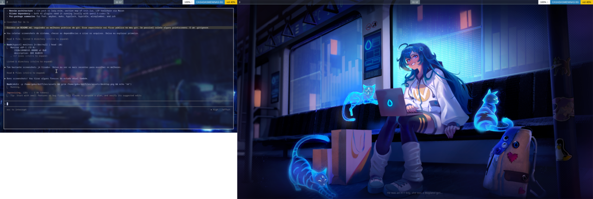
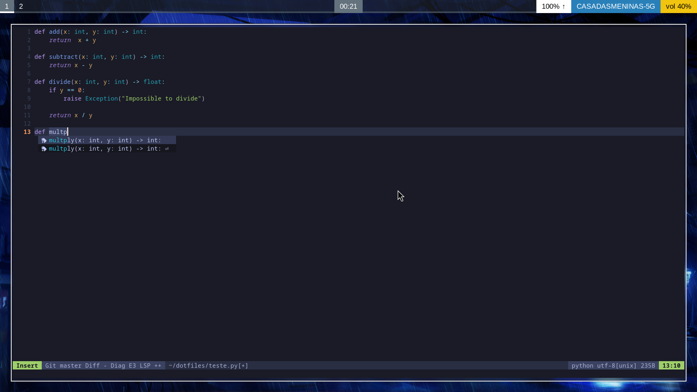
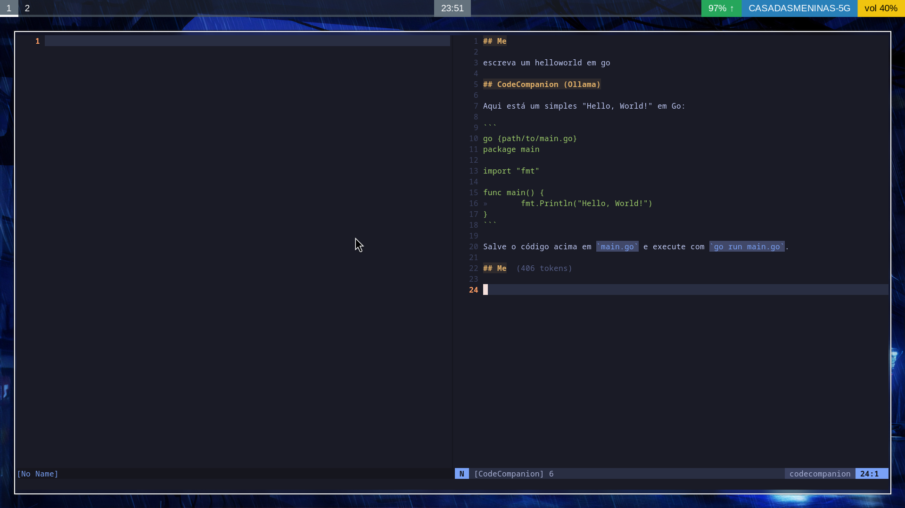

# dotfiles

Personal dotfiles for a CachyOS (Arch-based) Linux setup running **Hyprland** on Wayland.



## Stack

| Layer | Tool |
|-------|------|
| WM | [Hyprland](https://hyprland.org/) (Lua config) |
| Terminal | [Foot](https://codeberg.org/dnkl/foot) |
| Bar | [Waybar](https://github.com/Alexays/Waybar) |
| Launcher | [Fuzzel](https://codeberg.org/dnkl/fuzzel) |
| Notifications | [Mako](https://github.com/emersion/mako) |
| Wallpaper | [Hyprpaper](https://github.com/hyprwm/hyprpaper) |
| Lock screen | [Hyprlock](https://github.com/hyprwm/hyprlock) |
| Idle daemon | [Hypridle](https://github.com/hyprwm/hypridle) |
| Shell | Zsh + [Powerlevel10k](https://github.com/romkatv/powerlevel10k) |
| Editor | [Neovim](https://neovim.io/) (kickstart-based) |
| Theme | [Tokyo Night](https://github.com/folke/tokyonight.nvim) / [Catppuccin Mocha](https://catppuccin.com/) |

## Neovim

Based on [kickstart.nvim](https://github.com/nvim-kickstart/kickstart.nvim), using **`vim.pack`** (Neovim's built-in plugin manager).



**LSP / tooling** — managed by [Mason](https://github.com/mason-org/mason.nvim): `gopls`, `ts_ls`, `ruff`, `basedpyright`, `lua_ls`, `stylua`

**AI coding** — [CodeCompanion](https://github.com/olimorris/codecompanion.nvim) (chat + inline) and [Minuet](https://github.com/milanglacier/minuet-ai.nvim) (FIM autocomplete) via local [Ollama](https://ollama.com/) with `qwen2.5-coder:7b`.



## Requirements

- [GNU Stow](https://www.gnu.org/software/stow/)
- Hyprland with Lua scripting support (`hyprland-lua`)
- Ollama (for AI features in Neovim): `ollama pull qwen2.5-coder:7b`
- A [Nerd Font](https://www.nerdfonts.com/) (optional, `vim.g.have_nerd_font = false` by default)

## Installation

```bash
git clone https://github.com/<your-user>/dotfiles.git ~/.dotfiles
cd ~/.dotfiles

# Deploy individual packages
stow nvim
stow zsh
stow hyprland
stow foot
# ... etc.

# Or deploy everything at once
stow */
```

Each directory is a Stow package. Running `stow <package>` symlinks its contents into `$HOME`, mirroring the directory structure.

> **Note:** Back up any existing configs before stowing, as Stow will refuse to overwrite non-symlinked files.

## Structure

```
dotfiles/
├── foot/           # Terminal emulator
├── hypridle/       # Idle → dim → lock → DPMS pipeline
├── hyprland/       # Compositor (Lua modules: env, autostart, keybinds)
├── hyprlock/       # Lock screen
├── hyprpaper/      # Wallpaper daemon
├── mako/           # Notification daemon
├── nvim/           # Neovim (kickstart + vim.pack)
├── waybar/         # Status bar
├── wireplumber/    # Bluetooth auto-connect
└── zsh/            # Shell (p10k, nvm, uv)
```

## Keybinds (Hyprland)

| Key | Action |
|-----|--------|
| `Super + Return` | Open terminal (foot) |
| `Super + Space` | Launcher (fuzzel) |
| `Super + C` | Close window |
| `Super + L` | Lock screen |
| `Super + M` | Exit Hyprland |
| `Super + h/j/k/l` | Focus window (vim-style) |
| `Super + 0–9` | Switch workspace |
| `Super + Shift + 0–9` | Move window to workspace |
| `Super + V` | Clipboard history (cliphist) |
| `Super + B` | Bluetooth (bluetuith) |
| `Print` | Screenshot region |
| `Super + Print` | Screenshot active monitor |

## License

MIT
